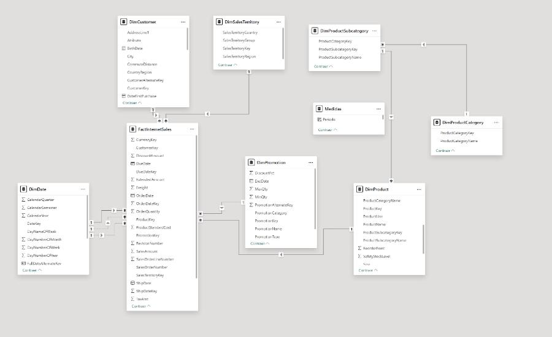

# Power BI — AdventureWorks Sales Dashboard

**Stack:** Power BI (Power Query + DAX) · AdventureWorksDW2019 (SQL) · Excel (DimCustomer)  
**Archivos:** [PBIX](./AdventureWorks_Sales.pbix) · [Informe PDF](./docs/adventureworks.pdf) · [Mockup](./docs/mockup_adventureworks.pptx)

---

## 🎯 Objetivo
Panel financiero con **ingresos, COGS, utilidad bruta/net**, vistas global y **detalle USA**.

---

## 📦 Datos
- SQL: `FactInternetSales`, `DimDate`, `DimCustomer`, `DimSalesTerritory`, `DimProduct*`, `DimPromotion`…
- Excel: `DimCustomer` (complemento).

---

## ⚙️ Proceso (Power Query)
1. Conexión a SQL + Excel.
2. Limpieza (columnas nulas/irrelevantes) y normalización de claves.
3. Merge `DimCustomer` + `Geography` (ciudad/país).
4. Deshabilito carga de tablas auxiliares (solo para relaciones).

---

## 🧩 Modelo
Relaciones 1-N (estrella) entre dimensiones y `FactInternetSales`.  
<p align="center">
  
</p>

---

## 📐 Medidas DAX (extracto)
```DAX
TotalIngresos   = SUM(FactInternetSales[SalesAmount])
COGS            = SUM(FactInternetSales[TotalProductCost])
UtilidadBruta   = [TotalIngresos] - [COGS]
%MargenBruto    = DIVIDE([UtilidadBruta], [TotalIngresos], 0)
TotalIngresosLY = CALCULATE([TotalIngresos], DATEADD(DimDate[FullDateAlternateKey], -1, YEAR))

📊 Páginas
	•	Financiero: KPIs (Ingresos, UB, UN, COGS), %márgenes, combo por mes, mapa por país.
	•	Detalle USA: matriz (Estado ▶ Ciudad ▶ Categoría ▶ Subcategoría),
comparativo Ingresos vs LY, dispersión COGS vs %margen.

⸻

🔎 Hallazgos
	•	2014: ≈ $29M ingresos; COGS ≈ $17M; UB ≈ $12M; UN ≈ $9M.
	•	Ratio de costo ↑ levemente vs LY; márgenes bruto ~43 % y neto ~31 %.
	•	Estados top: CA, FL, NY; ciudades con COGS alto pero margen estable (p. ej., Bellflower, Burbank, Berkeley).

⸻

▶️ Abrir
	1.	Descarga y abre AdventureWorks_Sales.pbix en Power BI Desktop.
	2.	Si conectas al DW original, refresca y valida las medidas.


Autor: Eric Sanchez — Data Analyst (Admin & Finance)
