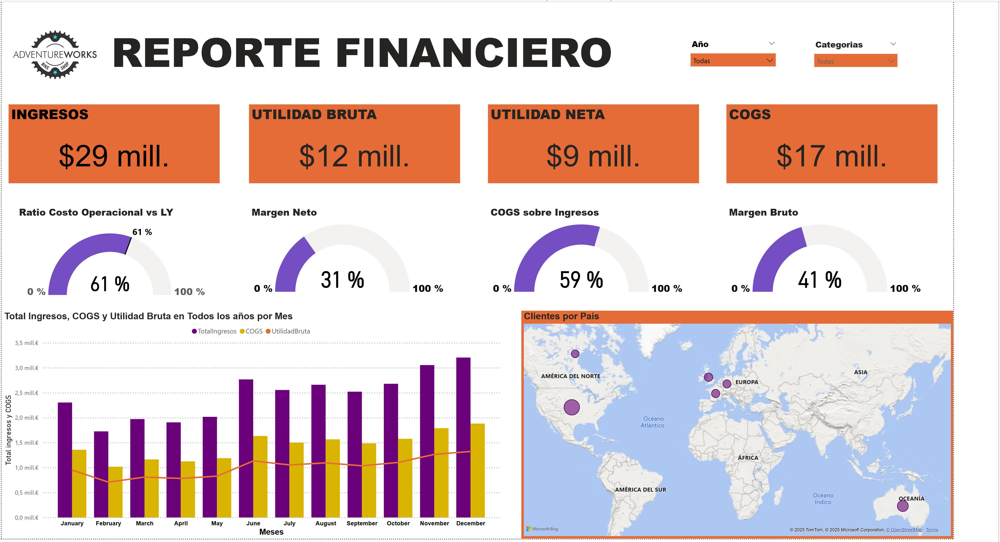
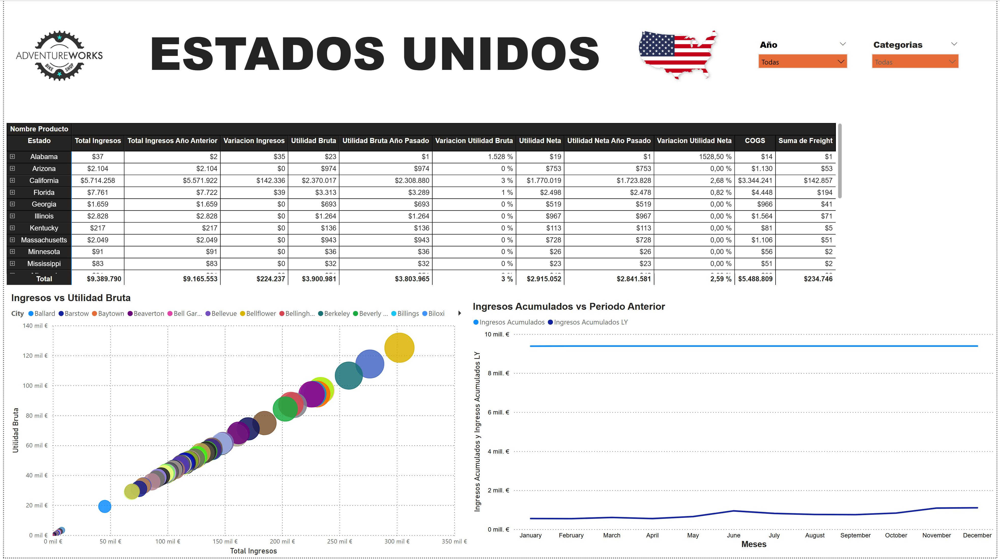

# Power BI — AdventureWorks Sales Dashboard

**Stack:** Power BI (Power Query + DAX) · AdventureWorksDW2019 (SQL) · Excel (DimCustomer)  
**Archivos:** [PBIX](/adventureworks.pbix) · [Informe PDF](/docs/adventureworks.pdf) · [Mockup](/docs/mockup%20adventureworks.pptx)

---

## 🎯 Objetivo

Panel financiero con **ingresos, COGS, utilidad bruta/neta**, vista global y **detalle USA**.

---

## 📦 Datos

- **SQL:** `FactInternetSales`, `DimDate`, `DimCustomer`, `DimSalesTerritory`, `DimProduct*`, `DimPromotion`…  
- **Excel:** `DimCustomer` (complemento de geografía: ciudad/país).

---

## 🔄 Proceso (Power Query)

1) Conexión a SQL + Excel.  
2) Limpieza (columnas nulas/irrelevantes) y normalización de claves.  
3) Merge **`DimCustomer` + `Geography`** (ciudad/país).  
4) Deshabilitar carga de tablas auxiliares (solo para relaciones).

---

## 🧩 Modelo

Relaciones **1-N (estrella)** entre dimensiones y **`FactInternetSales`**.

<p align="center">
  
</p>

---

## 🖼️ Dashboards (capturas)

<p align="center">
  
</p>

<p align="center">
  
</p>

> *Tip:* haz clic derecho → **Open image in new tab** para ver a tamaño completo.

---

## 📐 Medidas DAX (extracto)

```DAX
TotalIngresos  = SUM(FactInternetSales[SalesAmount])
COGS           = SUM(FactInternetSales[TotalProductCost])
UtilidadBruta  = [TotalIngresos] - [COGS]
%MargenBruto   = DIVIDE([UtilidadBruta], [TotalIngresos], 0)

TotalIngresosLY =
  CALCULATE([TotalIngresos], DATEADD(DimDate[FullDateAlternateKey], -1, YEAR))

Páginas
	•	Financiero: KPIs (Ingresos, UB, UN, COGS), % márgenes, combo por mes, mapa por país.
	•	Detalle USA: matriz (Estado ► Ciudad ► Categoría ► Subcategoría), comparativo Ingresos vs LY, dispersión COGS vs % margen.

Hallazgos
	•	2014: ≈ $29M ingresos; COGS ≈ $17M; UB ≈ $12M; UN ≈ $9M.
	•	Ratio de costo levemente ↑ vs LY; márgenes bruto ~43 % / neto ~31 %.
	•	Estados top: CA, FL, NY; ciudades con COGS alto pero margen estable (ej.: Bellflower).

⸻

▶️ Abrir
	1.	Descarga y abre Adventureworks.pbix en Power BI Desktop.
	2.	Si conectas al DW original, refresca y valida las medidas.

⸻

📁 Estructura (resumen)

powerbi-adventureworks-sales/
├─ README.md
├─ adventureworks.pbix
├─ docs/
│  ├─ adventureworks.pdf
│  └─ mockup adventureworks.pptx
└─ img/
   ├─ diagrama.jpeg
   ├─ adventureworks1.jpeg
   └─ adventureworks2.jpeg

Autor: Eric Sanchez 
